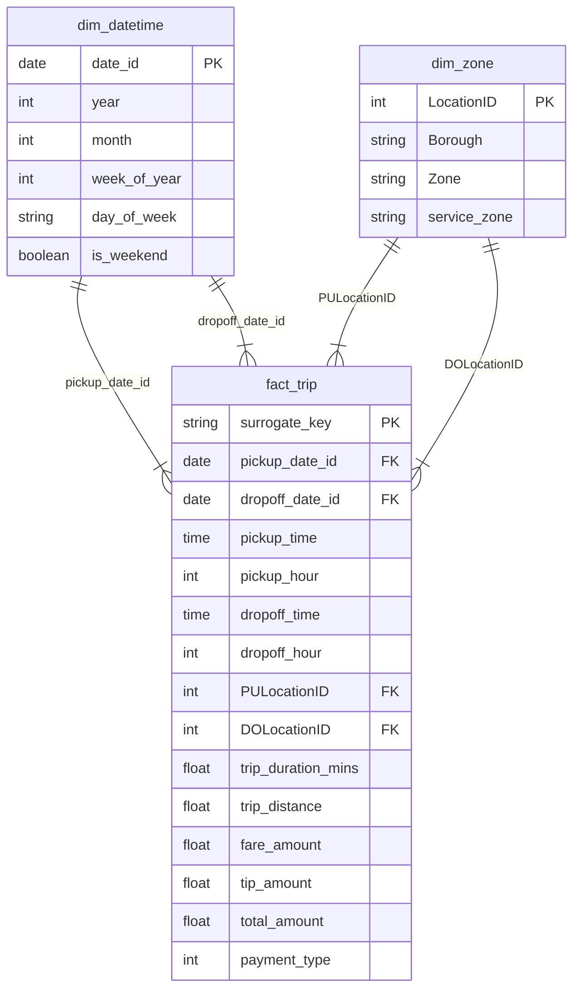

# RideNow Data Engineering Pipeline

A containerized, end-to-end data engineering pipeline built with PySpark. This project transforms raw taxi trip data into high-value, aggregated metrics using a Medallion Architecture (Bronze/Silver/Gold).

## 🚀 Pipeline Architecture
* **Bronze:** Raw Parquet/CSV ingestion.
* **Silver:** Data cleaning, type casting, surrogate key generation, and data quality validation.
* **Gold:** Business-level aggregations (Daily Revenue, Tip Rates) ready for BI consumption.
* **Quarantine:** Isolated storage for records failing validation, now including support for automated root-cause audit scripts.

## 🛠️ Engineering Highlights
* **Dead Letter Queue (Quarantine):** Invalid records are automatically routed to a `/quarantine` folder, ensuring auditability and zero data loss.
* **Data Quality Gates:** Implemented a 'fail-fast' approach; the pipeline utilizes assertions to halt execution if data doesn't meet quality standards.
* **Performance Optimization:** 
    * Implemented `.repartition()` and `.coalesce()` to solve the "Small File Problem," ensuring optimal Parquet file sizes for downstream storage and read performance.
    * Containerized with Docker to ensure a consistent, reproducible environment.
* **Idempotency:** Designed to allow safe, repeated runs without data duplication through partition-level overwrites.
* **SQL-Based Auditability:** Integrated DuckDB-ready SQL audit scripts to perform ad-hoc root-cause analysis on quarantined records, allowing for quick identification of data quality trends without requiring full pipeline re-execution.

## 📊 Analytical Workflows

This Lakehouse architecture supports both automated reporting and ad-hoc exploratory analysis:

*   **Automated Gold Tables:** For scheduled, high-performance dashboarding, pre-aggregated metrics (like Daily Revenue and Tip Rates) are computed via PySpark and saved to `data/gold/`.
*   **Ad-Hoc Exploration:** For rapid data discovery without requiring a Spark cluster, analysts can query the clean, partitioned Silver layer directly. I have included a lightweight `ridenow_taxi_sample_queries.sql` file that uses DuckDB to run business outputs directly against the raw Parquet files.

## 🏗️ Getting Started
1. Clone the repository.
2. Run the pipeline:
   `docker compose up`
3. Processed results are available in `data/silver/` and `data/gold/`.
4. **Data Quality Auditing:** Use the provided SQL audit scripts to analyze quarantined records:
   `duckdb < audit_quarantine.sql`

## 🔄 Incremental Loading (Adding April 2024 Data)
The pipeline utilizes Spark's dynamic partition overwrite mode. To process the April 2024 data without triggering a full historical reload, the input read must be restricted to the new data. In a production state, this is typically handled by parameterizing the target file or archiving processed files. For local execution:
1. Ensure only the new `yellow_tripdata_2024-04.parquet` file is present in the target Bronze ingestion directory, either archiving older files or parameterising the main.py script.
2. Trigger the pipeline. 
3. Spark will read only the April data and dynamically overwrite only the `pickup_month=2024-04` partition in the Silver layer, bypassing historical data entirely.

## 📌 Assumptions & Data Choices
To complete this pipeline within the 3 to 4-hour timebox, the following parameters were applied:
* **No Downsampling:** The pipeline processes the full dataset provided without applying any row limits or `.sample()` filters, proving performance at the provided scale.
* **Data Quality Thresholds:** Records with negative fare amounts, missing critical Zone IDs, or trip distances of 0 were considered invalid and automatically routed to the quarantine layer. 
* **Time Zones:** All timestamps were assumed to be localized to the standard TLC system time; no UTC conversions were applied during this stage.

## ⏱️ Post-Timebox Reflections: Next Steps for Production

*Note: The core deliverables above were completed within the requested 3 to 4-hour timebox. The following notes outline how I would scale this into a robust, production-grade pipeline if given more time.*

*   **Upgrade to a Modern Table Format:** While Spark's dynamic partition overwrite handles standard incremental loads well, I would transition the storage layer from raw Parquet to Apache Iceberg or Delta Lake. This provides a transactional metadata layer, allowing for `MERGE INTO` (upsert) operations to seamlessly handle late-arriving records without rewriting entire partitions.
*   **Implement the Full Gold Star Schema:** Currently, the pipeline directly aggregates daily metrics from the Silver layer. For a true BI-ready data warehouse, I would build out the full Kimball star schema with a central `fact_trip` table and conformed dimensions (`dim_zone`, `dim_datetime`).
*   **Dedicated Orchestration:** Instead of running the Python script manually via Docker Compose, I would wrap the execution in a DAG using an orchestrator like Apache Airflow or Dagster to manage dependencies, scheduling, and retries.
*   **Advanced Data Quality Framework:** The current pipeline uses inline Python `assert` statements to fail fast on data violations. In production, I would replace this with a dedicated testing framework to automatically profile the data and generate data quality reports.

### Future State: Gold Star Schema

If time permitted, the final Gold layer would be modeled as a Kimball star schema to optimize downstream BI performance. 

